# DevOps Challenge \#1 #
In this challenge, you will move the current monolith application towards the cloud. The local SQL Server should be replaced with SQL Azure, and the website should be converted to a PaaS Web App on Azure. The deployment of this website should be done with an automated build and release pipeline.

## Content ##
* [Achievements](#achievements)
* [Bonus Goals](#bonus-goals)
* [Pre-requisites](#pre-requisites)
* [Getting started](#getting-started)
* [Resources](#resources)

## Achievements ## 

| # | Achievement   |
|---|---------------|
|1| Configure a build agent|
|2| Create the server environment|
|3| Update the application to use the Azure SQL database |
|4| Set up a build pipeline that builds the web application in to a MSDeploy package |
|5| Set up a release pipeline that publishes the application to production |
|6| Deploy a change in the website with Continuous Deployment |

## Bonus goals ##

| # | Bonus goal   |
|---|---------------|
|1| Add an extra stage to the release pipeline that uses a deployment slot|
|2| Create a backlog with work and a task board with tasks|
|3| Set up some usage counters with Application Insights in the website|
|4| Create a feature toggle that "reveals" new functionality|
|5| Use configuration to inject the connection string for the application during deployment|
|6| Use an ARM template to configure and deploy the website and database in Azure|
|7| Use approvers to create a controlled deployment pipeline|

## Pre-requisites ##
* Build and release pipeline per team
* Visual Studio 2017 Enterprise 
* Azure Subscription
* Team Project for venue with git repo per challenge team
* VSTS account per participant
* Participants need administrator role on the Default Agent Pool (to be able to install a local build agent)
* Participants need administrator rights to add new service end-points in VSTS 

## Getting started ##
In this first excercise you will create a repo for the application code.

1. Go to [https://github.com/GlobalDevOpsBootcamp/challenge1](https://github.com/GlobalDevOpsBootcamp/challenge1) and get the Git clone URL.
2. Go to your VSTS account website https://[....].visualstudio.com and connect to your project using the account provided by your organizer.
3. Go to the Code hub and import the Git repo


4. Now when you have the code in place you can clone it using your tool of choice. Start Visual Studio and open the Team Explorer window (*View -> Team Explorer*)

5. Press the *Manage Connections* button, and the select *Manage Connections -> Connect to Team Project*

6. Click on  *Servers...* and then *Add* to add a connection to the GDBC project.

7. Log in using your supplied credentials

8. Once connected, select your team project from the list of team projects.

9. Clone the project by browsing to the **Challenge1 repository** that is located beneath your team project in the Connect page:

    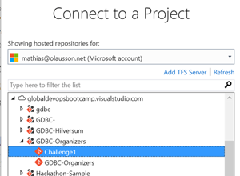
    
10. Accept the default local path (which should be *%HOMEPATH%\source\repos\Challenge1*) and select *Clone*

    

**Note:** the repo will have a master branch but also a completed branch. If you get stuck you can peek in the completed branch and see if helps you move forward.

## Achievement \#1 - Configure a build agent ##
For this workshop we will use local build servers. In this step you will setup a local 
agent on your own machine to simulate an internal build server running against VSTS.

### Create a build pool ###
1. Go to the VSTS team settings and select the Agent Queue hub.
2. Click the "New queue..." button and create a queue and also a new pool, name it
by your assigned user id (i.e. UserNN).


 
### Create a Personal Access Token for the build agent ###
In order to setup the build agent we need a way to configure how it can access
resources in VSTS. The way we do this is by using a personal access token (PAT).

1. Login to the VSTS account and click on the profile link and select Security.

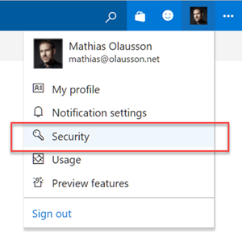

2. Add a new Personal access token, name it **GDBC** and authorize it to the 
**Agent Pools (read, manage)** scope.

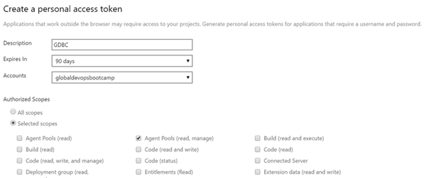

3. Copy the PAT token and save it in a temporary notepad file, we will use it in the next step when we configure the agent.


More information about personal access tokens:

[Create VSTS PAT](https://www.visualstudio.com/en-us/docs/setup-admin/team-services/use-personal-access-tokens-to-authenticate)

### Install a local build agent ###
1. Go to the VSTS team settings and select the Agent Queue hub.
2. Click on the "Download agent" button to download. 
3. Open a PowerShell command prompt as administrator.
4. Run the following commands to extract the agent:

    ```
    mkdir c:\vsts-agent
    cd c:\vsts-agent
    Add-Type -AssemblyName System.IO.Compression.FileSystem ; [System.IO.Compression.ZipFile]::ExtractToDirectory("$HOME\Downloads\vsts-agent-win7-x64-2.116.1.zip", "$PWD")
    ```
**Note**: check the version of the file since it may have changed since this text was written.

5. Configure the agent. Provide the **agent queue** created earlier, the account name **https://[....].visualstudio.com** and 
use the **PAT** from the previous step.

    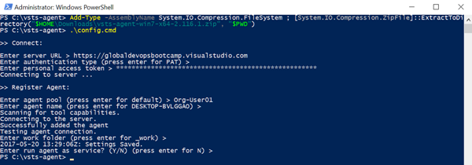

6. Run the agent interactively

    

7. Now the agent should be up and running. Switch back to the VSTS team settings and look at
the status in the agent queue.

    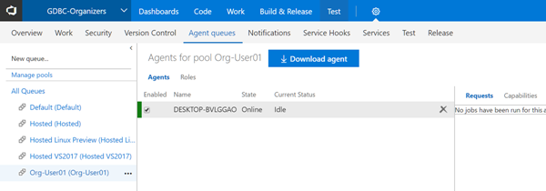

8. Make sure that your build and release definitions point to this build agent by using capabilities and demands (!)

## Achievement \#2 - Create the server environment ##
Now we need a place to host our application in Azure. We want to use the PaaS services in Azure to host a website and a database.

1. Logon to [https://portal.azure.com](https://portal.azure.com).

2. Create a new **resource group** for the environment, name the resource group the unique team name you have been assigned.

    

3. Next add a web app to the resource group, name the web app the unique team name you have been assigned. Choose to create a new free app service plan.

    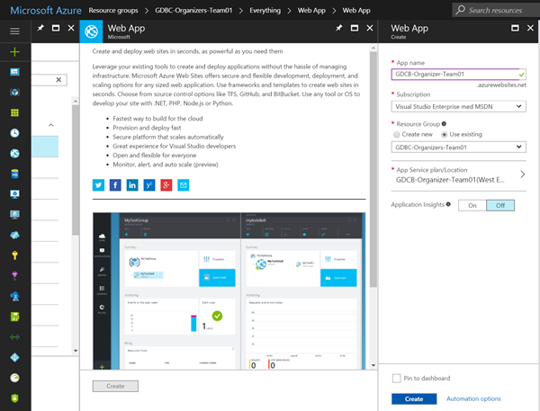

4. Finally add an Azure SQL database. Name the database **MusicStore** and use a **Basic** pricing tier.

    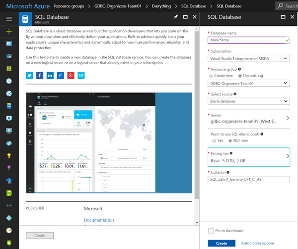

    Choose to create a new SQL Server. Name the server the unique team name assigned to you and create a login called **musicstore-admin** with password **P2ssw0rd**.

    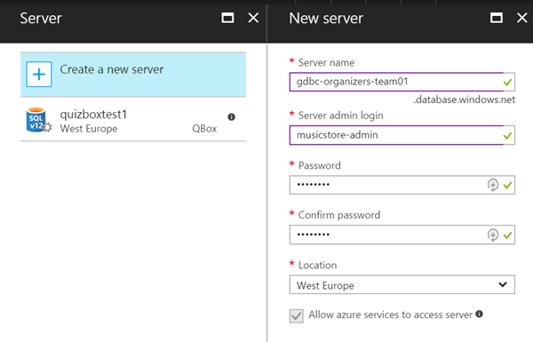

## Achievement \#3 - Update the application to use the Azure SQL database ##
The application uses Entity Framework to manage the database. This means that if the database does not exist it will be created. So with that we don't need to manage the database schema or create a database, all we need to do is ensure that the application has an updated connection string that points to the Azure SQL database.

1. Find the connection string to the Azure database:

    

    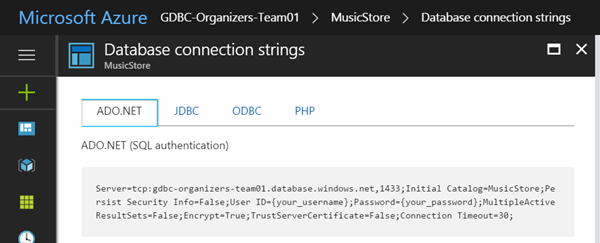

2. Update the Music Store **web.release.config** file. Here's an example of a connection string:

    ```
    <add name="MusicStoreEntities" connectionString="<server_name>;Initial Catalog=<database_name>;Integrated Security=False;User ID=<user_id>;Password=<password>;Connect Timeout=60;Encrypt=False;TrustServerCertificate=True;ApplicationIntent=ReadWrite;MultiSubnetFailover=False" providerName="System.Data.SqlClient" />
    ```

    

## Achievement \#4 - Configure a VSTS Build process ##
In this step you will create a new build definition in VSTS that 
* Use a CI trigger to continuously validate the code
* Use WebDeploy to create a deployment artifact
* Publish the WebDeploy package as a build artifact

1. Create a new build definition from the Code or Build hub in VSTS. Use the ASP.NET (preview) template.

    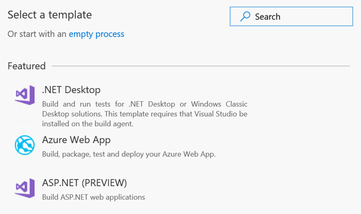

2. Disable the test step, these test will not

3. Make sure the build definition is set to use the agent queue configured in the previous step.


## Achievement \#5 - Configure a VSTS Release pipeline ##
With the build in place you can now setup a release definition in VSTS to manage the release process.

Here are some of the things the release process for Music store to Azure PaaS should be able to do:

* Use a CD trigger to continuously deploy the application when a new build comes out
* Use environments to model the infrastructure and the release process
* Use WebDeploy to publish the application to the Azure environment

1. Create a new release defintion from the build (or from the release hub in VSTS).

    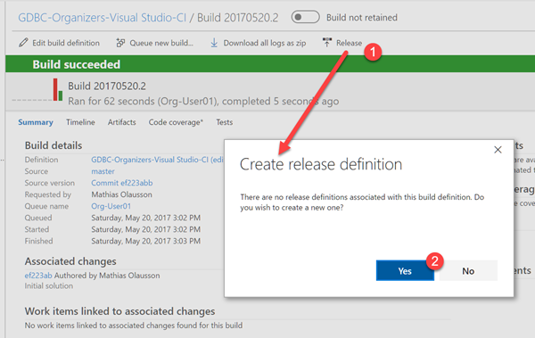

    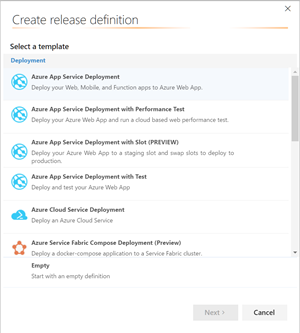
    
2. Accept the default values for the artifacts and select Continuous Deployment (which means that a new build will automatically trigger a new release).

    

3. Rename the release definition to Team<team-number-assigned>-Challenge1

    

4. Next we need to connect the release pipeline to Azure in order to deploy our web to the Azure resource group. Select the Deploy Azure App Service task and select the Azure subscription assigned to you. The service connection should already have been created as a pre-requisite to the challenge.

    Select the app service created earlier and browse to the Web Deploy package from the build artifact.

    

Note: make sure you have selected the correct agent under the "Run on agent" hyperlink.

## Achievement \#6 - Deploy the application ##
Now you should be ready to deploy your application using CI/CD for the first time. Make a small code change, commit it and look at the change go through the build and deploy process.

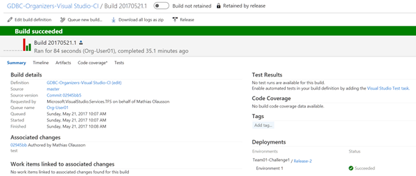

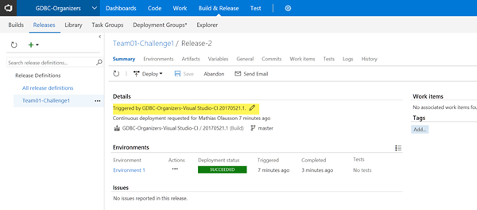

## Resources ##
* [Azure SQL Database](https://docs.microsoft.com/en-us/azure/sql-database/)
* [VSTS CI and CD overview](https://www.visualstudio.com/en-us/docs/build/overview)